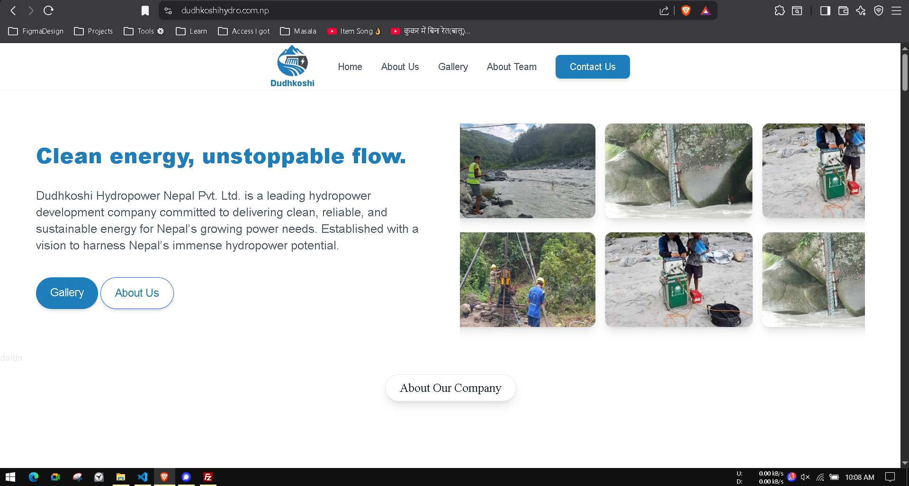
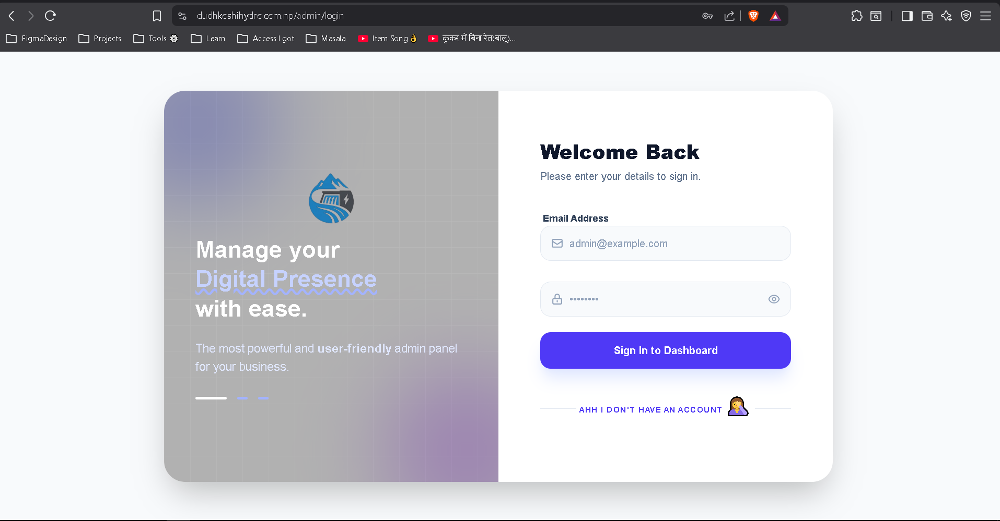

# Dynamic Next.js Website with Express & MySQL ✅✅
#

## Preview
[SEE WEBSITE](https://dudhkoshihydro.com.np)


## Admin Panel
[SEE ADMIN PANEL](https://dudhkoshihydro.com.np/admin/login)

 

# Dynamic Next.js Website with Express & MySQL

This is a fully dynamic website built with **Next.js 16+** for the frontend and **Express.js** with a **MySQL** database for the backend.

The website features a single landing page with the following dynamic sections:

- **Hero Section**
- **Middle Section**
- **Team Section**
- **FAQ Section**
- **Blog Section**
- **Footer**

Everything on the page is dynamically fetched from the backend.

---

## 🛠 Tech Stack

- **Frontend:** Next.js 16+  
- **Backend:** Express.js  
- **Database:** MySQL  
- **Authentication:** JWT  

---

## 🚀 Getting Started

Follow these steps to run the project locally:

### 1. Clone the Repository

```bash
git clone https://github.com/DharmendraWD/dudhkoshi-fullstack
cd dudhkoshi-fullsatck
```

## Create a .env file in the backend folder with the following content:
DB_HOST=localhost
DB_USER=root
DB_PASSWORD=""
DB_NAME=dudhkoshi
PORT=4000
JWT_SECRET=""

Create a .env file in the frontend folder with the following content:
BASE_CONTENT_URL=http://localhost:4000/
NEXT_PUBLIC_BASE_CONTENT_URL=http://localhost:4000/
NEXT_PUBLIC_BASE_API=http://localhost:4000/api
BASE_API=http://localhost:4000/api

## 🚀 Run Project
### --Backend
cd backend
npm install
npm run dev

### --Frontend
cd frontend
npm install
npm run dev

### ---> The frontend will be available at http://localhost:3000


## 🔐 Admin Panel
To log in to the admin panel:
Manually create a new user in the users table of the MySQL database.
Access the admin login page at: http://localhost:3000/admin/login


## 📄 Features
Fully dynamic landing page content
Easy admin management
Blog section dynamically fetched from the backend
JWT-based authentication for the admin panel


## ⚡ Notes
Make sure MySQL is running locally before starting the backend.
Ensure the .env variables match your local setup.